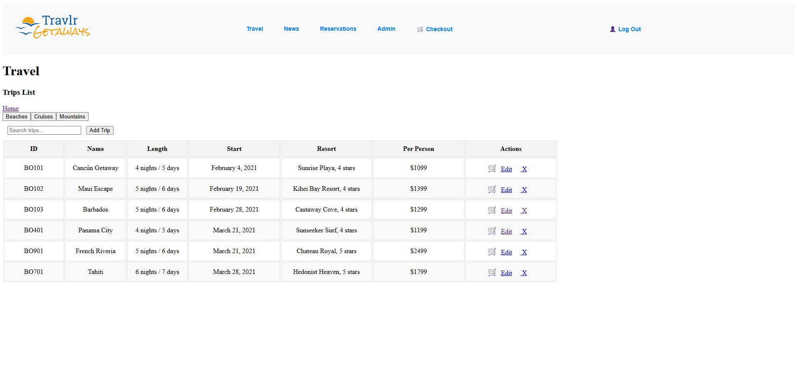

<link rel="stylesheet" href="../../assets/css/custom.css">

# Algorithms & Data Structures Artifact

## Overview

The artifact I selected for the Algorithms and Data Structures outcome is my **Travlr Getaways** full-stack web application, originally developed in **CS-465** using **Node.js, Express, Angular, and MongoDB**. For this enhancement, I focused on strengthening the application’s efficiency and security through the use of **algorithmic logic and structured data handling**. These updates demonstrate how data structures and algorithms can be used to improve both performance and system resilience. I chose this artifact because it provided a real-world opportunity to apply algorithmic thinking across a live application that interacts with user input, databases, and authentication systems.

*Landing page of the Travlr Getaways application built using the MEAN stack.*

---

## What I Improved

During this enhancement phase, I improved how the application handles data queries, login requests, and user tracking through the following updates:

- Added a **search algorithm** that filters trips based on multiple database fields—such as trip code, name, resort, and description—using a **case-insensitive regular expression match** for flexible and efficient querying.
  
- Implemented a **rate limiting algorithm** on the login route using `express-rate-limit` to reduce the risk of brute-force attacks while maintaining usability.
   
- Built a **server-side event logging system** that records user activity, including successful and failed logins, into a dedicated MongoDB collection.
  
- Began development of a **recommendation engine** that uses tokenized word similarity to suggest “similar trips,” laying the groundwork for later machine-learning-driven personalization.  

These enhancements demonstrate my ability to design and apply algorithms that balance **security, performance, and user experience** in a production-style environment.

*The original trip listing page without filtering or search optimization.*

*Enhanced trip search now supports multi-field, case-insensitive filtering
for efficient querying.*

*Category-based filtering allows users to quickly find matching destinations.*
---

## Code Review Notes

This phase built directly upon the **recommendations** identified during my original **code review video**. I analyzed the efficiency of my search logic, the need for better login protections, and the absence of consistent logging.

🎥 [**Watch Code Review Video – Part 1**](https://youtu.be/yE4y5FZN2ck)  
🎥 [**Watch Code Review Video – Part 2**](https://youtu.be/-rbaklZHxl4)

**Key improvements from review to enhancement:**

- Replaced manual filtering with a structured query using MongoDB’s `$or` operator for multi-field matching.
  
- Added a **token-based scoring system** to rank similar trips and make results more relevant.
  
- Integrated **express-rate-limit** middleware to enforce request limits and reduce attack vectors.
  
- Created an **eventLog** model to store security-related events for auditing and tracking.

*JavaScript implementation of the login rate limiter restricting excessive login attempts.*

*MongoDB collection recording system events for auditing and anomaly detection.*

*Results returned by the recommendation logic based on user trip history.*

---

## Reflection

This artifact demonstrates my ability to **design and apply algorithmic solutions** that enhance functionality, security, and user experience. Implementing search optimization, rate limiting, and event logging required combining **algorithmic reasoning** with an understanding of how structured data flows between the client, server, and database.

The experience taught me how to:
- Design algorithms that scale gracefully under user load.  
- Balance responsiveness and protection using adaptive limits.  
- Use structured logging and data models to make complex systems observable and testable.  

Through these improvements, I gained deeper insight into how well-designed algorithms serve as the backbone of reliable web systems—a lesson that directly supports my professional goals in cybersecurity and system architecture.

*The “Similar Trips” algorithm analyzes and suggests related destinations for users.*

---

## Evidence

- **GitHub Repository:** [Travlr Getaways Repository](https://github.com/thatone313/CS465FullStackDevelopment)  
- **Code Review Videos:**  
  - [Part 1](https://youtu.be/yE4y5FZN2ck)  
  - [Part 2](https://youtu.be/-rbaklZHxl4)
  - 
- **Relevant Files:**
- 
  - [app_api/controllers/trips.js](../../supporting_files/trips.js)– role, 2FA fields, and recovery codes
  - [app_api/routes/index.js](../../supporting_files/index.js) – route based access control
  - [app_api/models/eventLog.js](../../supporting_files/eventLog.js) – structured event tracking
    
    

