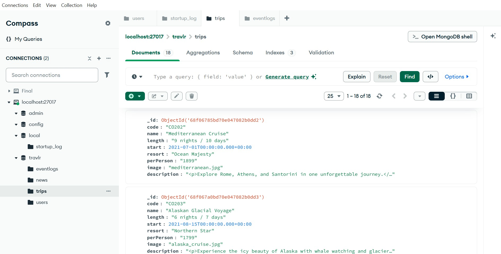
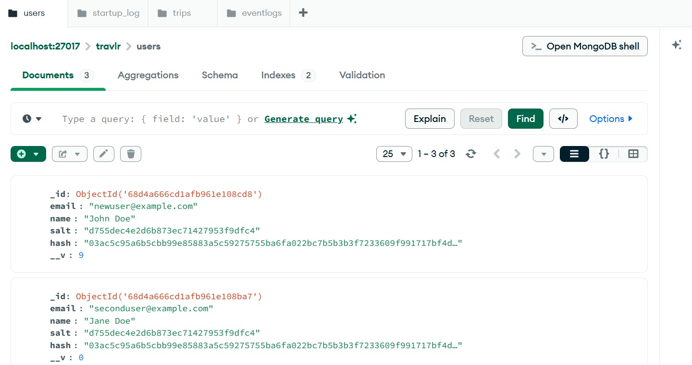
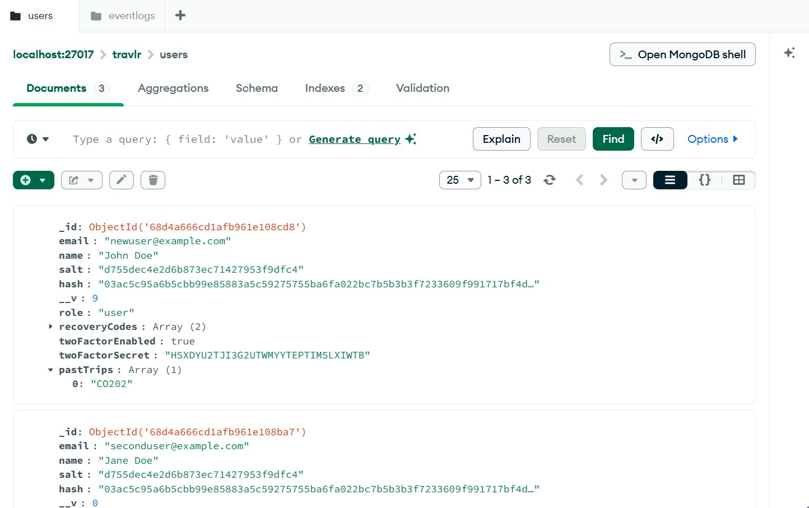
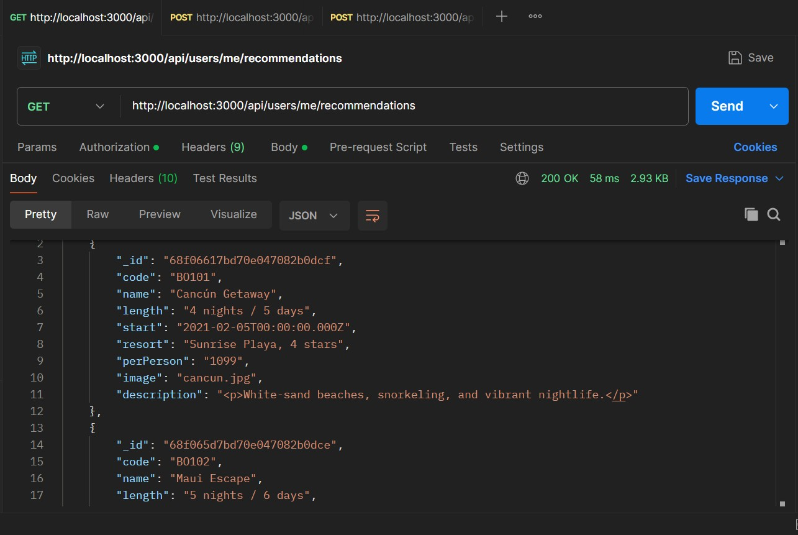
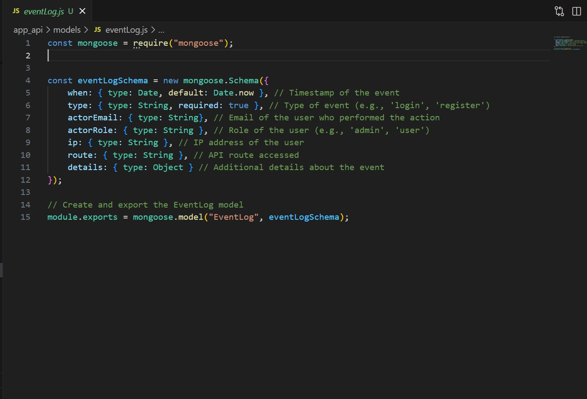
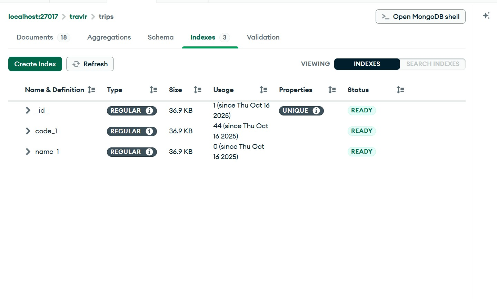
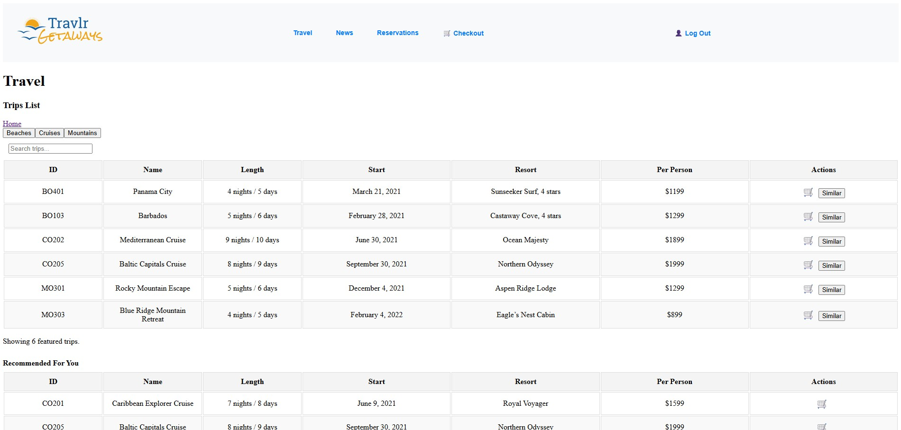

<link rel="stylesheet" href="../../assets/css/custom.css">

# Databases Artifact

## Overview

The artifact I selected for the Databases outcome is my **Travlr Getaways** full-stack web application, built with the **MEAN stack** (MongoDB, Express, Angular, and Node.js). This project originally served as a travel booking system but was enhanced during CS-499 to demonstrate advanced database design, secure storage, and data-driven personalization. I chose this artifact because it clearly demonstrates my ability to design, query, and optimize a database to support scalable and secure application functionality. It also shows how back-end data structures drive intelligent features like recommendations and event tracking.

*MongoDB Compass view showing collections for users, trips, and event logs.*

---

## What I Improved

The database enhancements focused on strengthening **data security, structure, and integration** between the back end and front end. They support the **Databases Outcome** by showing how I improved the structure, security,
and organization of stored data to make the system more reliable and scalable. 

**Key updates included:**

- Restructured the **MongoDB user schema** to include `pastTrips` for storing user travel history.
  
- Designed a new **eventLog collection** to capture and categorize user activity such as logins, 2FA events, and system updates.
  
- Implemented **Two-Factor Authentication (2FA)** and **recovery codes**, ensuring that all secrets are encrypted or hashed before being stored.
   
- Added **login rate limiting** and **event persistence** to link user behavior to database records for auditing.
  
- Optimized queries used in the **recommendation feature** to generate personalized suggestions based on previous trips.  

These updates improved the reliability, traceability, and overall performance of the application while following industry best practices for **database normalization, indexing, and data protection**.

*Original user schema without fields for 2FA, recovery codes, or history.*

*Enhanced user schema now includes secure 2FA fields, recovery codes, and pastTrips for tracking user activity.*

*Example of personalized recommendations generated from stored user history.*

---

## Code Review Notes

These enhancements were informed by the same **code review** used to identify improvements across authentication, logging, and schema design. The review confirmed that database interactions lacked consistent logging and that sensitive user data required stronger encryption and structure.

🎥 [**Watch Code Review Video – Part 1**](https://youtu.be/yE4y5FZN2ck)  
🎥 [**Watch Code Review Video – Part 2**](https://youtu.be/-rbaklZHxl4)

**Key improvements based on review:**

- Introduced a dedicated `eventLog` model for structured auditing.
   
- Updated `user.js` schema with additional fields and encryption logic.
   
- Ensured all authentication events write to the database for traceability.
  
- Applied indexes and query optimization to improve retrieval times for trips and user history.  

*EventLog model used to store and organize login and activity events.*

*Indexes created on trip collection fields to improve query performance.*

---

## Reflection

This enhancement demonstrates my ability to **design and manage databases that are secure, efficient, and adaptable**. By implementing stronger schemas and logging mechanisms, I created a system capable of supporting both real-time functionality and administrative insights.

The process deepened my understanding of:

- Balancing data structure flexibility with performance.
   
- Implementing encryption, hashing, and indexing for secure, optimized queries.
  
- Integrating databases seamlessly with front-end features like personalized recommendations.  

These improvements directly support my professional goals in **cybersecurity and system architecture**, where secure, well-structured data systems are critical.

*Query results displaying travel recommendations based on previous trips.*

*Front-end output of the recommendation feature populated dynamically.*

---

## Evidence

- **GitHub Repository:** [Travlr Getaways Repository](https://github.com/thatone313/CS465FullStackDevelopment)  
- **Code Review Videos:**  
  - [Part 1](https://youtu.be/yE4y5FZN2ck)  
  - [Part 2](https://youtu.be/-rbaklZHxl4)

    
- **Relevant Files:**
  
  - [app_api/models/user.js](../../supporting_files/models_user.js) – updated schema updates, encryption, and pastTrips field  
  - [app_api/models/eventLog.js](../../supporting_files/eventLog.js) – new logging schema and structure
  - [app_api/controllers/users.js](../../supporting_files/controllers_users.js)– history tracking and recommendation logic  
  - [app_api/controllers/authentication.js](../../supporting_files/authentication.js) – database integration with 2FA and recovery codes
    
 
 - **Supporting Documentation:**
  - [Milestone Four Narrative](../../supporting_files/CS499MilestoneFour.docx)
  - [Travlr Getaways Software Design (Milestone 4)](https://drive.google.com/file/d/16QbBx-q-nHm7J7De-FdLKpwf-exF8yHc/view?usp=drive_link)

