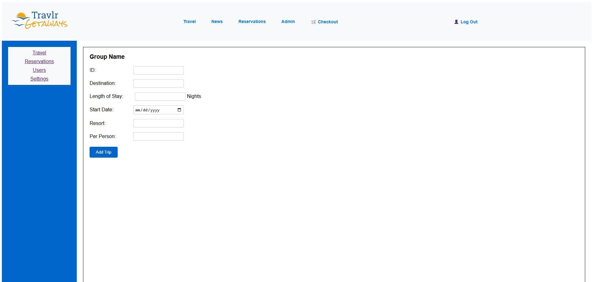
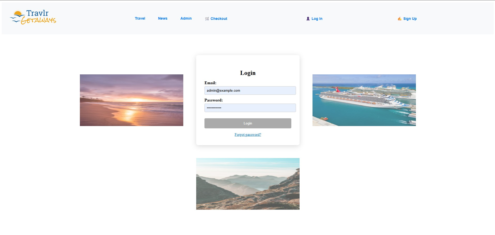
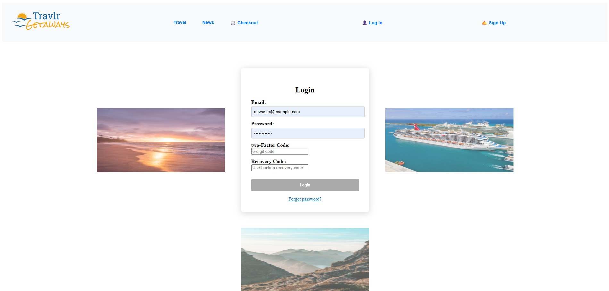
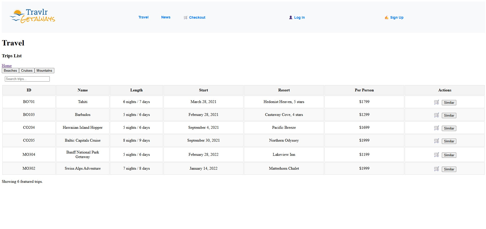
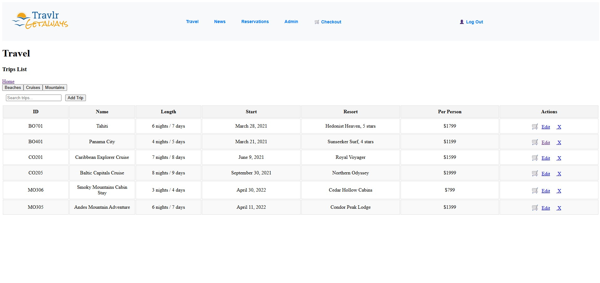
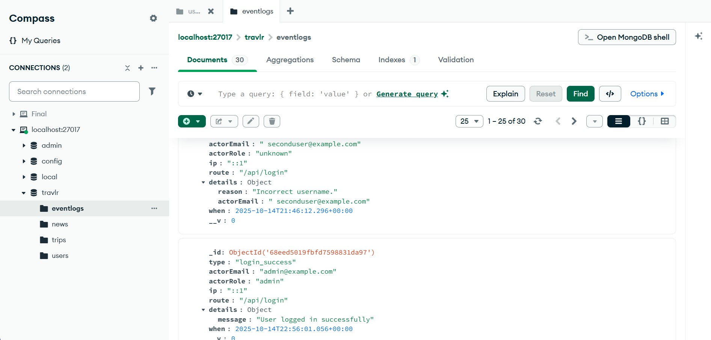
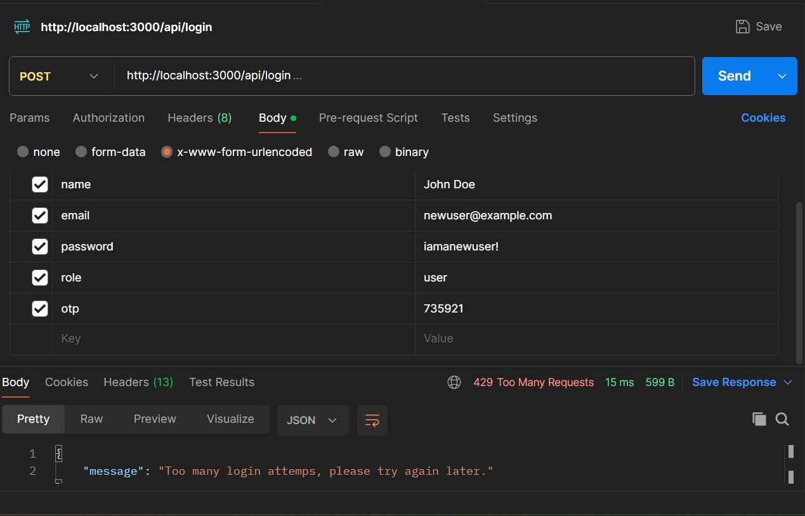
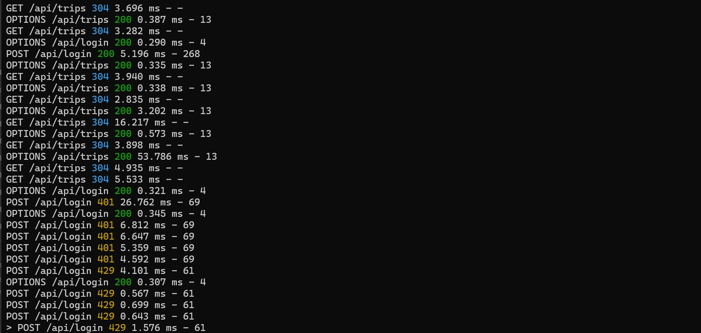
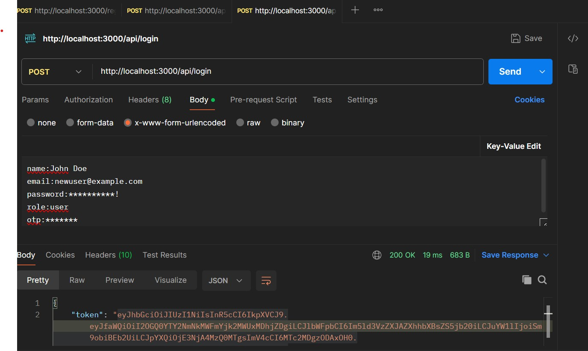

<link rel="stylesheet" href="../../assets/css/custom.css">

# Software Design & Engineering Artifact

## Overview
The artifact I selected for the Software Design and Engineering outcome is my **Travlr Getaways** full-stack travel booking web application, originally developed in **CS-465** using the **MEAN stack** (MongoDB, Express, Angular, and Node.js). This application allows users to browse, book, and manage travel experiences through a secure, interactive interface that includes both user and administrator functions. I selected this artifact because it demonstrates my ability to design, develop, and maintain a modular, production-style web application that integrates the front-end and back-end using secure and scalable design principles.

-

---

## What I Improved
For this enhancement, I focused on strengthening the **authentication system**, **role management**, and **logging structure** to meet professional software-engineering standards.

**Enhancements completed:**
- Implemented **Time-based One-Time Password (TOTP) Two-Factor Authentication (2FA)** using the **Speakeasy** library.
  
- Added **recovery codes** that are securely hashed and stored for backup authentication.
  
- Introduced **Role-Based Access Control (RBAC)** to separate **admin** and **user** permissions.
  
- Added **structured error logging** using a new MongoDB event-logging model to track both successful and failed logins.
   
- Improved **session handling** and **token validation** through JSON Web Tokens (JWT) containing user roles.
   
- Integrated **login rate limiting** middleware to reduce brute-force attack attempts.

These changes enhanced the security, reliability, and maintainability of the application while demonstrating the application of software-engineering principles such as **modularity, abstraction, and secure design**.

-

-

-

-

-

-

-

---

## Code Review Notes
Before starting these enhancements, I recorded a full **code review video** that evaluated areas for improvement in the authentication, routing, and model layers.  
This video covered existing vulnerabilities and outlined the plan to strengthen design and security practices.

🎥 - **Code Review Video - Part 1:** [Watch Here](https://youtu.be/yE4y5FZN2ck)
🎥 - **Code Review Video - Part 2:** [Watch Here](https://youtu.be/-rbaklZHxl4) 

**Key takeaways from my review:** 

- Authentication lacked 2FA and structured error logging.
  
- Admin features were not properly protected by role checks.
    
- The login route allowed unlimited requests with no rate limit.
   
- Session handling was basic and could be made more secure.  

These insights guided my refactoring strategy, ensuring that enhancements were purposeful, testable, and in line with real-world secure coding practices.

[**Watch Code Review Discussoin of Authentication Issues **](https://youtu.be/Nrz5_AwpX3g)

---

## Reflection

This enhancement demonstrates my ability to **apply software engineering principles to create robust, secure, and scalable solutions**. By implementing 2FA, RBAC, and event logging, I built an authentication system that protects both user data and administrative access. I also improved the application’s modularity and readability through cleaner route handling, controller separation, and standardized responses. Through this process, I strengthened my understanding of **secure design patterns**, **separation of concerns**, and **real-world authentication flows**—skills that directly support my career goals in **network architecture and cybersecurity**.

---

## Evidence

- **GitHub Repository:** [Travlr Getaways Repository](https://github.com/thatone313/CS465FullStackDevelopment)  
- **Code Review Video - Part 1:** [Watch Here](https://youtu.be/yE4y5FZN2ck)
- **Code Review Video - Part 2:** [Watch Here](https://youtu.be/-rbaklZHxl4)
  
- **Relevant Files:**
   
  - [authentication.js](https://github.com/thatone313/MWheeler_CS499_ePortfolio/blob/main/supporting_files/authentication.js) – 2FA logic and JWT handling
  - [user.js](https://github.com/thatone313/MWheeler_CS499_ePortfolio/blob/main/supporting_files/user.js)– role, 2FA fields, and recovery codes
  - [app.routes.ts](https://github.com/thatone313/MWheeler_CS499_ePortfolio/blob/main/supporting_files/app.routes.ts) – route based access control
  - [eventLog.js](https://github.com/thatone313/MWheeler_CS499_ePortfolio/blob/main/supporting_files/eventLog.js) – structured event tracking

    

